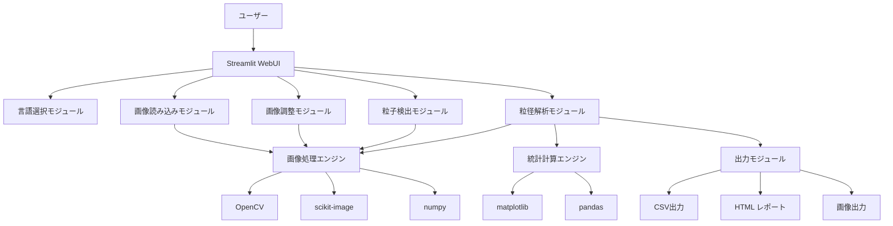
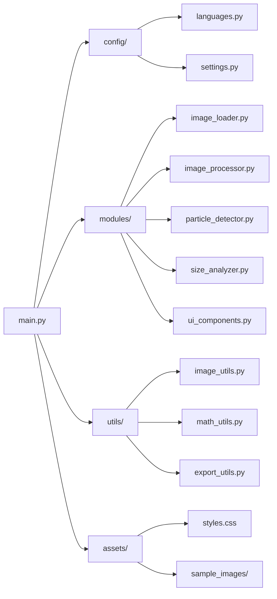

# SEM粒径分布解析アプリケーション 設計書

## プロジェクト概要

SEM画像（Tiff, PNG, BMP, JPG等）を読み込み、WebUI上で対話的に粒径分布の抽出が可能なアプリケーションを開発します。

### 主要要件
- Docker環境での実行
- 多言語対応（日本語・英語）
- タブベースの画面切り替え
- 対話的な画像処理・解析機能

## システム構成図



## アプリケーション構造



## 技術スタック

### フロントエンド
- **Streamlit**: WebUIフレームワーク
- **HTML/CSS**: カスタムスタイリング
- **streamlit-drawable-canvas**: 対話的描画機能

### バックエンド
- **Python 3.9+**: メイン言語
- **OpenCV**: 画像処理
- **scikit-image**: 画像解析・閾値化
- **numpy**: 数値計算
- **pandas**: データ処理
- **matplotlib/plotly**: グラフ描画
- **Pillow**: 画像I/O

### デプロイメント
- **Docker**: コンテナ化
- **Docker Compose**: 環境管理

## 機能詳細設計

### 1. 言語選択機能
- **実装方法**: `st.selectbox`による選択UI
- **データ管理**: セッション状態での言語設定保持
- **多言語対応**: 辞書ベースの翻訳システム
- **適用範囲**: UI表示 + 出力ファイルのパラメータ名・カラム名

### 2. フロー1: 画像読み込み
- **ファイル選択**: `st.file_uploader`でマルチフォーマット対応
- **画像表示**: Streamlitネイティブ表示 + 再表示ボタン
- **スケール設定**: 
  - streamlit-drawable-canvasで赤線描画
  - 入力ボックスでμm値指定
  - ピクセル/μm変換係数計算
- **ワークスペース管理**: 新画像読み込み時の既存データリセット

### 3. フロー2: 画像調整
- **前処理機能**:
  - ガウシアンフィルタ
  - メディアンフィルタ
  - ブラックポイント・ホワイトポイント調整
  - コントラスト補正
- **UI設計**:
  - 自動設定ボタン（2値化最適化ベース）
  - `st.slider`による手動パラメータ調整
  - リアルタイムプレビュー
  - 適用ボタンで結果確定

### 4. フロー3: 粒子検出
- **極性選択**: ラジオボタンで白地/黒地選択
- **関心領域設定**: 下部除外率調整（デフォルト6.5%）
- **閾値化手法**:
  - 自動: Otsu法、Li法、Yen法、Triangle法、Isodata法
  - 自動比較・最適選択機能
  - 手動: 閾値輝度調整
- **検出パラメータ**:
  - 最小面積・最大面積
  - 最小円形度（0.02刻み調整）
- **対話機能**:
  - 検出結果オーバーレイ表示
  - 右クリックメニューによる粒子分割
  - パラメータ調整後の再計算

### 5. フロー4: 粒径解析
- **ヒストグラム表示**:
  - 短辺・長辺・平均・等価直径
  - 実数スケール・対数スケール両対応
- **統計情報**:
  - 幾何平均（μm）
  - 幾何標準偏差（μm）
  - その他基本統計量
- **出力機能**:
  - 粒径画像ダウンロード
  - CSVデータダウンロード
  - HTMLレポート生成

## ファイル構成

```
SEMParticleAnalyzer/
├── main.py                 # メインアプリケーション
├── requirements.txt        # 依存関係
├── Dockerfile             # Docker設定
├── docker-compose.yml     # Docker Compose設定
├── README.md              # プロジェクト説明
├── 設計書.md              # この設計書
├── config/
│   ├── __init__.py
│   ├── languages.py       # 多言語設定辞書
│   └── settings.py        # アプリケーション設定
├── modules/
│   ├── __init__.py
│   ├── image_loader.py     # 画像読み込み・スケール設定
│   ├── image_processor.py  # 画像前処理
│   ├── particle_detector.py # 粒子検出・閾値化
│   ├── size_analyzer.py    # 粒径解析・統計計算
│   └── ui_components.py    # 共通UIコンポーネント
├── utils/
│   ├── __init__.py
│   ├── image_utils.py      # 画像処理ユーティリティ
│   ├── math_utils.py       # 数学・統計ユーティリティ
│   └── export_utils.py     # 出力・ダウンロードユーティリティ
├── assets/
│   ├── styles.css          # カスタムCSS
│   └── sample_images/      # サンプル画像
└── venv/                   # Python仮想環境
```

## 実装フェーズ

### Phase 1: 基盤構築
1. プロジェクト構造作成
2. 仮想環境・依存関係設定
3. 基本Streamlitアプリ構築
4. 多言語対応基盤

### Phase 2: 画像処理機能
1. 画像読み込み機能
2. スケール設定機能
3. 画像前処理機能
4. 基本UI構築

### Phase 3: 粒子検出機能
1. 閾値化アルゴリズム実装
2. 粒子検出・セグメンテーション
3. 対話的調整機能
4. オーバーレイ表示

### Phase 4: 解析・出力機能
1. 粒径計算・統計処理
2. ヒストグラム表示
3. 出力機能（CSV、HTML、画像）
4. 最終調整・テスト

### Phase 5: Docker化・最適化
1. Dockerfile作成
2. Docker Compose設定
3. パフォーマンス最適化
4. ドキュメント整備

## 開発ガイドライン

- **コーディング規約**: .clinerulesに準拠
- **コミット規約**: feat/fix/docs等のプレフィックス使用
- **テスト**: 各フェーズでの動作確認
- **エラーハンドリング**: 適切な例外処理とユーザーフィードバック
- **パフォーマンス**: 大容量画像対応・メモリ効率化

## 技術的考慮事項

### 画像処理最適化
- 大容量画像の効率的処理
- メモリ使用量の最適化
- 処理時間の短縮

### UI/UX設計
- 直感的な操作フロー
- リアルタイムフィードバック
- エラー状態の適切な表示

### 多言語対応
- 動的言語切り替え
- 出力ファイルの言語対応
- 文字エンコーディング対応

### Docker最適化
- 軽量なベースイメージ使用
- 効率的なレイヤー構成
- 開発・本番環境の統一